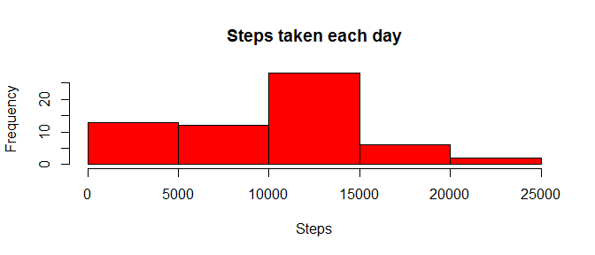
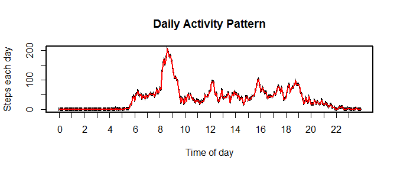
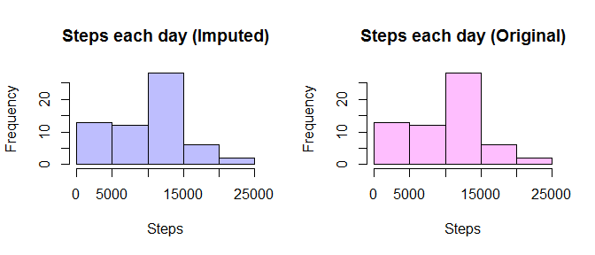
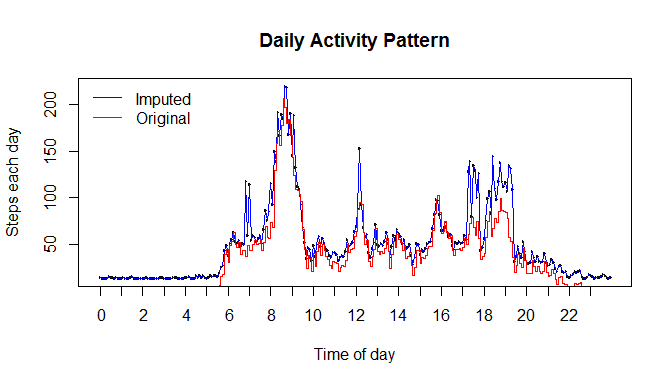
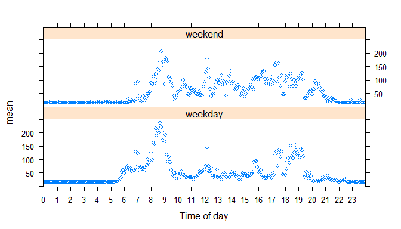

# Reproducible Research: Peer Assessment 1


## Loading and preprocessing the data


```r
dataset <- tbl_df(read.csv("activity.csv"))
dataset$tinterval <- sapply(dataset$interval, FUN <- function(x) ifelse (nchar(x)<4, paste(c(rep("0", 4-nchar(x)),x), collapse="", sep=""),x))
```

### What is mean total number of steps taken per day?

```r
stepseachday <- ddply(dataset, 'date', function(x) c(tsteps=sum(x$steps, na.rm=TRUE)))
hist(stepseachday$tsteps,col=2, main="Steps taken each day", xlab="Steps")
```

 

### what is mean and median of total number of steps taken per day ?

```r
meansteps <- mean(stepseachday$tsteps, na.rm=TRUE)
mediansteps <- median(stepseachday$tsteps, na.rm=TRUE)
```
Mean total number of steps taken per day is 9354.2295082
Median total number of steps taken per day is 10395


### What is the average daily activity pattern ?

```r
isteps <-ddply(dataset, 'tinterval', function(x) c(mean=mean(x$steps, na.rm=TRUE),median=median(x$steps, na.rm=TRUE)))
```

 

### Find the average maximum steps for the interval across all days

```r
msteps <- isteps[(isteps$mean == max(isteps$mean)),]
hours <- paste(substring(msteps$tinterval, 1,2), substring(msteps$tinterval, 3,4), sep=":")
maxsteps <- round(msteps$mean,0)
```
### During what interval, average maximum steps are taken?

An average 206 steps taken during 5 minute interval starting at 08:35 hours is the maximum average for an interval across all days.

### Calculate the missing values are in the dataset

```r
nasteps <- is.na(dataset$steps)
naset <- dataset[nasteps,]
missing <- nrow(naset)

#Replace missing values with median
dd<- apply(dataset, 1, FUN = function(x) {if (is.na(x["steps"])) {
    x["steps"] <- isteps[isteps$tinterval==x["tinterval"],]$median };x})
dataset2 <- data.frame(t(dd))

stepseachday2 <- ddply(.data = dataset, 'date', function(x) c(tsteps=sum(x$steps, na.rm=TRUE)))
isteps2 <-ddply(dataset2, 'tinterval', function(x) c(mean=mean(as.numeric(x$steps)),median=median(as.numeric(x$steps))))
```
### How many missing values are in the dataset
There are 2304 values in the data set
As shown above, the missing values were replaced with the median for that interval

### How do total steps taken per day with imputed dataset compares with original?
As you can see there is no difference in pattern between imputed dataset, and the original dataset for the steps taken each day
 

### What is daily activity pattern with imputed dataset (compared to original)?
For the daily activity pattern also, imputed dataset reflects higher average during morning times and the evening times, typically times with higher activity.  Early morning or late night aren't impacted a whole lot.
 
.

### Differences in activity patterns between weekdays and weekends?

```r
#Add weekday or weekend
dataset2$day <- as.factor(ifelse((wday(strptime(dataset2$date, format="%Y-%m-%d")) %in% 2:6),"weekday", "weekend"))
isteps3 <- ddply(dataset2, .(tinterval, day), summarize, mean=mean(as.numeric(steps)))
```

On the weekends it seems the activity starts a little late in the morning (i.e. people take their time to wake up as there is no work)
On weekdays, the activity number of steps taken 10 am and 5 pm are lower but constant
On weekends the activity is higher throughout the day, but little more sparsed
As expected there is almost no difference in the activity from late night to early morning.
 
